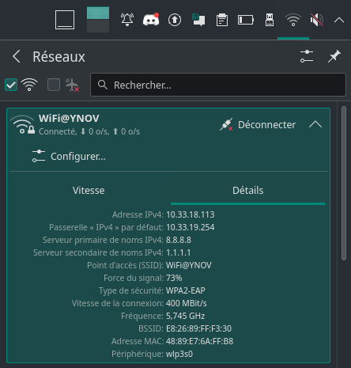
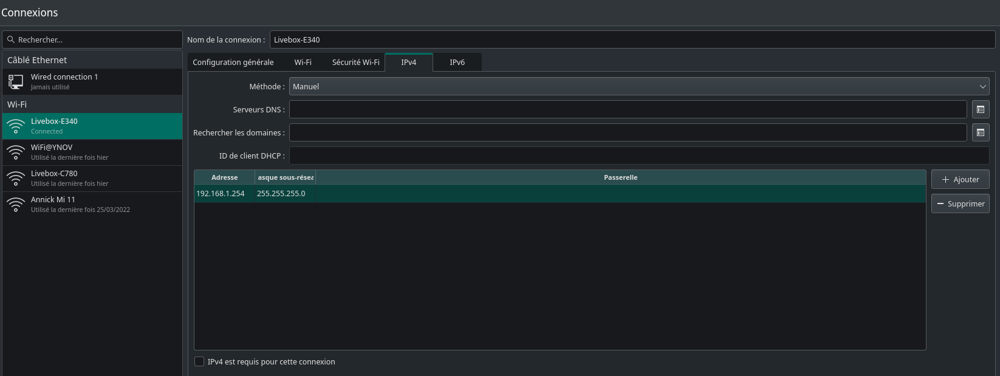
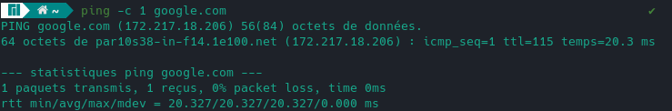
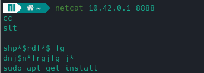
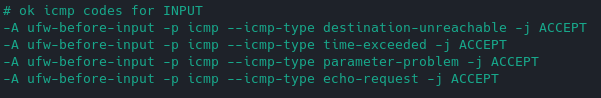
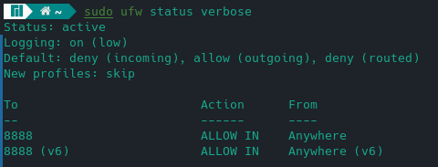
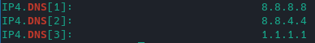
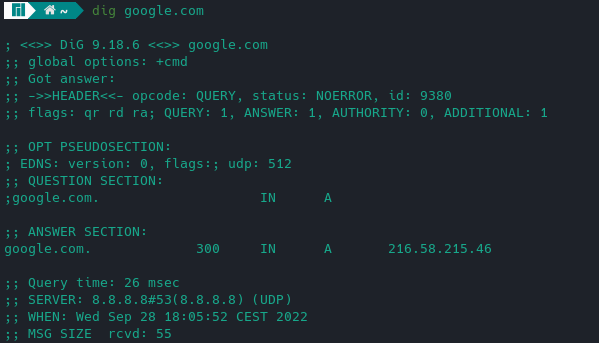
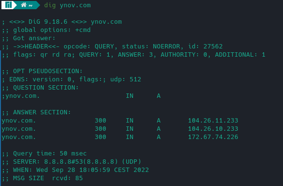
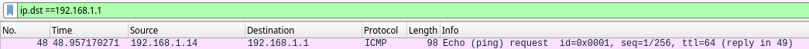

# I. Exploration locale en solo

## 1. Affichage d'informations sur la pile TCP/IP locale

### En ligne de commande

En utilisant la ligne de commande (CLI) de votre OS :

**🌞 Affichez les infos des cartes réseau de votre PC**
Commande: *ip a*
- **Interface Wi-Fi**: wlp3s0 ``48:89:e7:6a:ff:b8``, et ``192.168.1.26``
- **Interface Ethernet**: enp0s31f6, ``e8:6a:64:fb:e3:43`` et pas d'adresse IP

**🌞 Affichez votre gateway**
Commande: *ip n s*
- 192.168.1.1; 
### En graphique (GUI : Graphical User Interface)

En utilisant l'interface graphique de votre OS :  

**🌞 Trouvez comment afficher les informations sur une carte IP (change selon l'OS)**

- Sous MANJARO: Cliquer sur l'icône "Wi-Fi" > Détails
 

### Questions

- 🌞 à quoi sert la [gateway](../../cours/lexique/README.md#passerelle-ou-gateway) dans le réseau d'YNOV ?
Elle sert à faire le lien entre le réseau privé d'YNOV et public.

## 2. Modifications des informations

### A. Modification d'adresse IP (part 1)  

🌞 Utilisez l'interface graphique de votre OS pour **changer d'adresse IP** :
- Configuration du système > Connexions

🌞 **Il est possible que vous perdiez l'accès internet.** Que ce soit le cas ou non, expliquez pourquoi c'est possible de perdre son accès internet en faisant cette opération:
- On peut perdre sa connexion internet en essayant de se connecter à une adresse déjà allouée. (On peut envoyer, mais pas télécharger)

# II. Exploration locale en duo

## 3. Modification d'adresse IP

🌞Si vos PCs ont un port RJ45 alors y'a une carte réseau Ethernet associée :
- Après avoir modifié l'IP des deux machines (respectivement 192.168.1.254 et 192.168.2.253) connectées en LAN, un ping a été effectué pour vérifier la connectivité.
- Puis l'ARP est affichée avec la commande *arp*.

- 
 NOTE: kdieu-ubuntu est l'alias de 192.168.2.253/30

## 4. Utilisation d'un des deux comme gateway
Depuis le PC non-passerelle:
- 🌞 pour tester la connectivité à internet on fait souvent des requêtes simples vers un serveur internet connu
  - 
- 🌞 utiliser un `traceroute` ou `tracert` pour bien voir que les requêtes passent par la passerelle choisie (l'autre le PC)
- 

## 5. Petit chat privé

- 🌞 **sur le PC *serveur***
- On écoute le port 8888, mais rien ne se passe.
- 🌞 **sur le PC *client***
- On se connecte au port 8888 de l'autre machine, et ça fonctionne :
 

## 6. Firewall

Toujours par 2.

Le but est de configurer votre firewall plutôt que de le désactiver

- J'ai utilisé ufw pour activer mon firewall
- 🌞 Autoriser les `ping`
  Cette règle est présente dans le fichier configuration de ufw:
  - 
- 🌞 Autoriser le traffic sur le port qu'utilise `nc`
  - 
  
# III. Manipulations d'autres outils/protocoles côté client

## 1. DHCP

🌞Exploration du DHCP, depuis votre PC

La commande **nmcli con show WiFi@YNOV** permet d'afficher toutes les infos du client DHCP:

- Adresse IP du serveur DHCP du réseau WiFi YNOV : ``10.33.19.254``
- Date d'expiration du bail DHCP -> dhcp_lease_time = 80135 (22h15m)

## 2. DNS

- 🌞 trouver l'adresse IP du serveur DNS que connaît votre ordinateur:
- avec la commande **nmcli con show WiFi@YNOV | grep dns**:

- 🌞 utiliser, en ligne de commande l'outil `nslookup` (Windows, MacOS) ou `dig` (GNU/Linux, MacOS) pour faire des requêtes DNS à la main

  LOOKUP:
    - pour `google.com` :
    
    - pour `ynov.com` :
    
    - interpréter les résultats de ces commandes:
    - Avec *dig* j'ai demandé à quelle IP se trouvaient les noms de domaines (QUESTIONS), et les réponses sont listées dans ANSWERS.
  - déterminer l'adresse IP du serveur à qui vous venez d'effectuer ces requêtes: ``8.8.8.8``
  REVERSE-LOOKUP:
    - pour l'adresse `78.74.21.21` : 
    - pour l'adresse `92.146.54.88` : 
    - On peut en conclure que la première adresse renvoie à un nom de domaine, mais pas la seconde.

# IV. Wireshark

- 🌞 utilisez le pour observer les trames qui circulent entre vos deux carte Ethernet. Mettez en évidence :
  - un `ping` entre vous et la passerelle:
  
  - ~~un `netcat` entre vous et votre mate, branché en RJ45~~
  - une requête DNS. Identifiez dans la capture le serveur DNS à qui vous posez la question.:
  
Le serveur répondant à la question est ``35.186.224.25``
