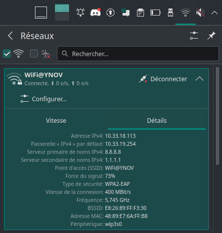
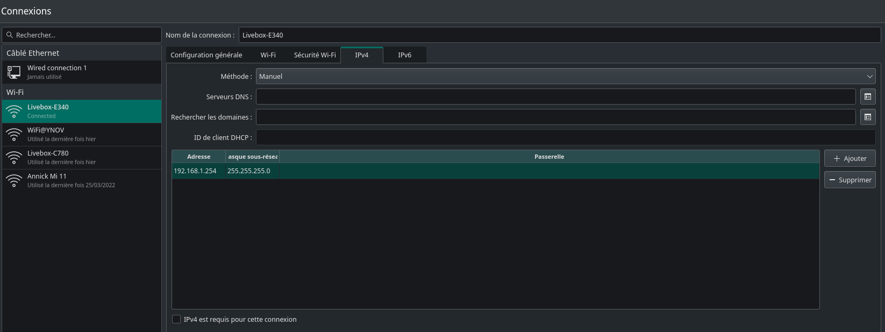
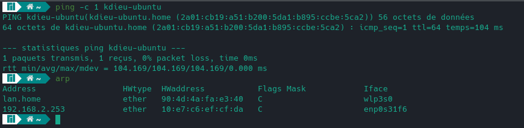
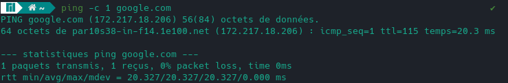
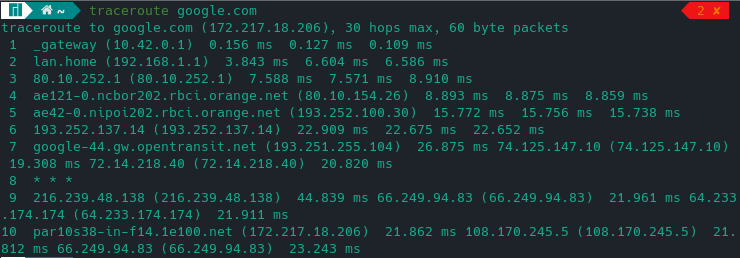

# I. Exploration locale en solo

## 1. Affichage d'informations sur la pile TCP/IP locale

### En ligne de commande

En utilisant la ligne de commande (CLI) de votre OS :

**🌞 Affichez les infos des cartes réseau de votre PC**
*ip a*

- wlp3s0, 48:89:e7:6a:ff:b8, et 192.168.1.26
- enp0s31f6, e8:6a:64:fb:e3:43 et pas d'adresse IP

**🌞 Affichez votre gateway**
*ip n s*

- 192.168.1.1; 
### En graphique (GUI : Graphical User Interface)

En utilisant l'interface graphique de votre OS :  

**🌞 Trouvez comment afficher les informations sur une carte IP (change selon l'OS)**

- Sous MANJARO: Cliquer sur l'icône "Wi-Fi" > Détails
- 

### Questions

- 🌞 à quoi sert la [gateway](../../cours/lexique/README.md#passerelle-ou-gateway) dans le réseau d'YNOV ?
- Elle sert à faire le lien entre le réseau privé d'YNOV et public.

## 2. Modifications des informations

### A. Modification d'adresse IP (part 1)  

🌞 Utilisez l'interface graphique de votre OS pour **changer d'adresse IP** :

- 

🌞 **Il est possible que vous perdiez l'accès internet.** Que ce soit le cas ou non, expliquez pourquoi c'est possible de perdre son accès internet en faisant cette opération.
- On peut perdre sa connexion internet en essayant de se connecter à une adresse déjà allouée. (On peut envoyer, mais pas télécharger)

# II. Exploration locale en duo

## 3. Modification d'adresse IP

🌞Si vos PCs ont un port RJ45 alors y'a une carte réseau Ethernet associée :

- 
- NOTE: kdieu-ubuntu est l'alias de 192.168.2.253/30

## 4. Utilisation d'un des deux comme gateway
- PC1: 
- 🌞 pour tester la connectivité à internet on fait souvent des requêtes simples vers un serveur internet connu
  - 
- 🌞 utiliser un `traceroute` ou `tracert` pour bien voir que les requêtes passent par la passerelle choisie (l'autre le PC)
- 

## 5. Petit chat privé

- 🌞 **sur le PC *serveur*** avec par exemple l'IP 192.168.1.1
- 🌞 **sur le PC *client*** avec par exemple l'IP 192.168.1.2
  - 

---

- 🌞 pour aller un peu plus loin
  - le serveur peut préciser sur quelle IP écouter, et ne pas répondre sur les autres
  - par exemple, on écoute sur l'interface Ethernet, mais pas sur la WiFI
  - pour ce faire `nc.exe -l -p PORT_NUMBER IP_ADDRESS`
  - par exemple `nc.exe -l -p 9999 192.168.1.37`
  - on peut aussi accepter uniquement les connexions internes à la machine en écoutant sur `127.0.0.1`

## 6. Firewall

Toujours par 2.

Le but est de configurer votre firewall plutôt que de le désactiver

- Activez votre firewall
- 🌞 Autoriser les `ping`
  - configurer le firewall de votre OS pour accepter le `ping`
  - aidez vous d'internet
  - on rentrera dans l'explication dans un prochain cours mais sachez que `ping` envoie un message *ICMP de type 8* (demande d'ECHO) et reçoit un message *ICMP de type 0* (réponse d'écho) en retour
- 🌞 Autoriser le traffic sur le port qu'utilise `nc`
  - on parle bien d'ouverture de **port** TCP et/ou UDP
  - on ne parle **PAS** d'autoriser le programme `nc`
  - choisissez arbitrairement un port entre 1024 et 20000
  - vous utiliserez ce port pour [communiquer avec `netcat`](#5-petit-chat-privé-) par groupe de 2 toujours
  - le firewall du *PC serveur* devra avoir un firewall activé et un `netcat` qui fonctionne
  
# III. Manipulations d'autres outils/protocoles côté client

## 1. DHCP

Bon ok vous savez définir des IPs à la main. Mais pour être dans le réseau YNOV, vous l'avez jamais fait.  

C'est le **serveur DHCP** d'YNOV qui vous a donné une IP.

Une fois que le serveur DHCP vous a donné une IP, vous enregistrer un fichier appelé *bail DHCP* qui contient, entre autres :

- l'IP qu'on vous a donné
- le réseau dans lequel cette IP est valable

🌞Exploration du DHCP, depuis votre PC

- afficher l'adresse IP du serveur DHCP du réseau WiFi YNOV
- cette adresse a une durée de vie limitée. C'est le principe du ***bail DHCP*** (ou *DHCP lease*). Trouver la date d'expiration de votre bail DHCP
- vous pouvez vous renseigner un peu sur le fonctionnement de DHCP dans les grandes lignes. On aura sûrement un cours là dessus :)

## 2. DNS

Le protocole DNS permet la résolution de noms de domaine vers des adresses IP. Ce protocole permet d'aller sur `google.com` plutôt que de devoir connaître et utiliser l'adresse IP du serveur de Google.  

Un **serveur DNS** est un serveur à qui l'on peut poser des questions (= effectuer des requêtes) sur un nom de domaine comme `google.com`, afin d'obtenir les adresses IP liées au nom de domaine.  

Si votre navigateur fonctionne "normalement" (il vous permet d'aller sur `google.com` par exemple) alors votre ordinateur connaît forcément l'adresse d'un serveur DNS. Et quand vous naviguez sur internet, il effectue toutes les requêtes DNS à votre place, de façon automatique.

- 🌞 trouver l'adresse IP du serveur DNS que connaît votre ordinateur

- 🌞 utiliser, en ligne de commande l'outil `nslookup` (Windows, MacOS) ou `dig` (GNU/Linux, MacOS) pour faire des requêtes DNS à la main

  - faites un *lookup* (*lookup* = "dis moi à quelle IP se trouve tel nom de domaine")
    - pour `google.com`
    - pour `ynov.com`
    - interpréter les résultats de ces commandes
  - déterminer l'adresse IP du serveur à qui vous venez d'effectuer ces requêtes
  - faites un *reverse lookup* (= "dis moi si tu connais un nom de domaine pour telle IP")
    - pour l'adresse `78.74.21.21`
    - pour l'adresse `92.146.54.88`
    - interpréter les résultats
    - *si vous vous demandez, j'ai pris des adresses random :)*

# IV. Wireshark

Wireshark est un outil qui permet de visualiser toutes les trames qui sortent et entrent d'une carte réseau.

Il peut :

- enregistrer le trafic réseau, pour l'analyser plus tard
- afficher le trafic réseau en temps réel

**On peut TOUT voir.**

Un peu austère aux premiers abords, une manipulation très basique permet d'avoir une très bonne compréhension de ce qu'il se passe réellement.

- téléchargez l'outil [Wireshark](https://www.wireshark.org/)
- 🌞 utilisez le pour observer les trames qui circulent entre vos deux carte Ethernet. Mettez en évidence :
  - un `ping` entre vous et la passerelle
  - un `netcat` entre vous et votre mate, branché en RJ45
  - une requête DNS. Identifiez dans la capture le serveur DNS à qui vous posez la question.
  - prenez moi des screens des trames en question
  - on va prendre l'habitude d'utiliser Wireshark souvent dans les cours, pour visualiser ce qu'il se passe

# Bilan

**Vu pendant le TP :**

- visualisation de vos interfaces réseau (en GUI et en CLI)
- extraction des informations IP
  - adresse IP et masque
  - calcul autour de IP : adresse de réseau, etc.
- connaissances autour de/aperçu de :
  - un outil de diagnostic simple : `ping`
  - un outil de scan réseau : `nmap`
  - un outil qui permet d'établir des connexions "simples" (on y reviendra) : `netcat`
  - un outil pour faire des requêtes DNS : `nslookup` ou `dig`
  - un outil d'analyse de trafic : `wireshark`
- manipulation simple de vos firewalls

**Conclusion :**

- Pour permettre à un ordinateur d'être connecté en réseau, il lui faut **une liaison physique** (par câble ou par *WiFi*).  
- Pour réceptionner ce lien physique, l'ordinateur a besoin d'**une carte réseau**. La carte réseau porte une [adresse MAC](../../cours/lexique/README.md#mac-media-access-control).  
- **Pour être membre d'un réseau particulier, une carte réseau peut porter une adresse IP.**
Si deux ordinateurs reliés physiquement possèdent une adresse IP dans le même réseau, alors ils peuvent communiquer.  
- **Un ordintateur qui possède plusieurs cartes réseau** peut réceptionner du trafic sur l'une d'entre elles, et le balancer sur l'autre, servant ainsi de "pivot". Cet ordinateur **est appelé routeur**.
- Il existe dans la plupart des réseaux, certains équipements ayant un rôle particulier :
  - un équipement appelé **[*passerelle*](../../cours/lexique/README.md#passerelle-ou-gateway)**. C'est un routeur, et il nous permet de sortir du réseau actuel, pour en joindre un autre, comme Internet par exemple
  - un équipement qui agit comme **serveur DNS** : il nous permet de connaître les IP derrière des noms de domaine
  - un équipement qui agit comme **serveur DHCP** : il donne automatiquement des IP aux clients qui rejoigne le réseau
  - **chez vous, c'est votre Box qui fait les trois :)**

🌞 Ce soleil est un troll. **Lisez et prenez le temps d'appréhender le texte de conclusion juste au dessus si ces notions ne vous sont pas familières.**
